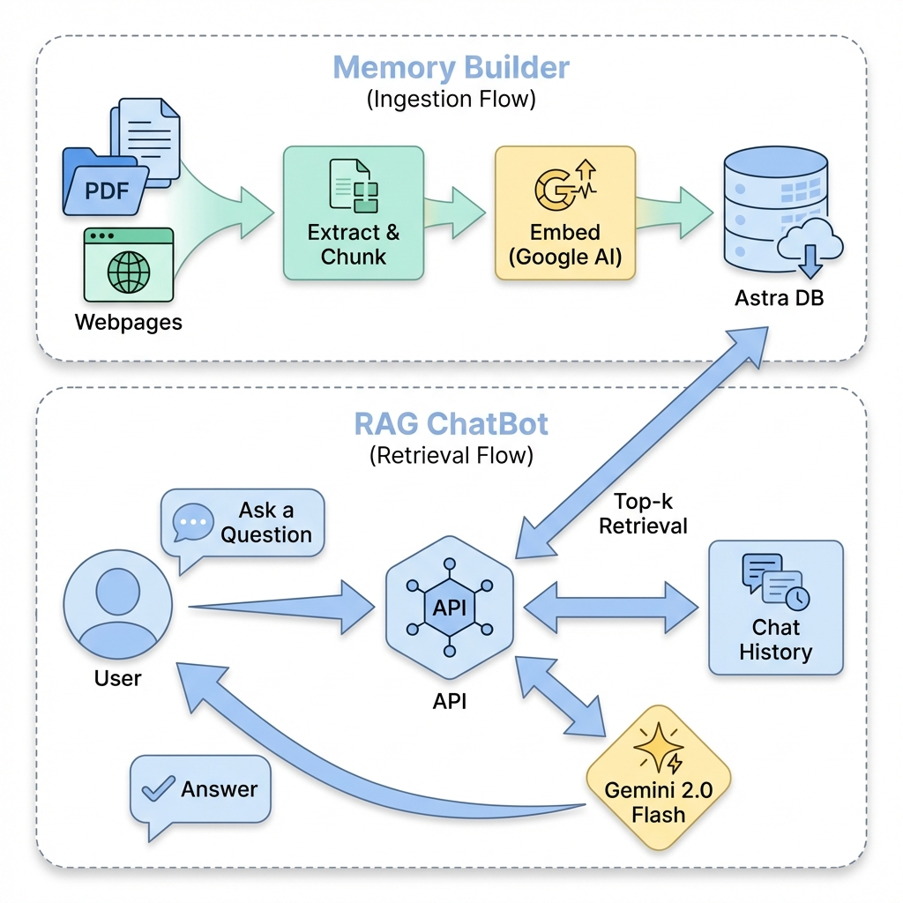

# Personal Intelligence App: RAG-based Chatbot

A personal intelligence engine that turns your portfolio and experience into an interactive, context-aware conversational agent.

## 🚀 Tech Stack
- **Framework**: [Next.js 15+](https://nextjs.org/) (App Router, Turbopack)
- **Styling**: [Tailwind CSS v4](https://tailwindcss.com/)
- **AI Models**: 
  - **LLM**: [Google Gemini 2.0 Flash](https://ai.google.dev/) (Free Tier)
  - **Embeddings**: [Google Text-Embedding-004](https://ai.google.dev/)
- **Database**: [DataStax Astra DB](https://astra.datastax.com/) (Serverless Vector DB)
- **Scraper**: [Puppeteer](https://pptr.dev/)
- **Orchestration**: [LangChain.js](https://js.langchain.com/)

## 🛠️ System Architecture & Workflow

## ⚙️ Workflow Details
1. **Scraping**: `scripts/scrape.ts` uses Puppeteer to crawl targets (e.g., your portfolio).
2. **Ingestion**: `scripts/loadDb.ts` chunks the text, generates vectors, and upserts them to Astra DB.
3. **Retrieval**: When a user asks a question, the system converts the question into a vector.
4. **Augmentation**: The top 5 most relevant document chunks are retrieved from Astra DB.
5. **Generation**: Gemini 2.0 Flash uses the context to generate a "Persona-driven" answer.