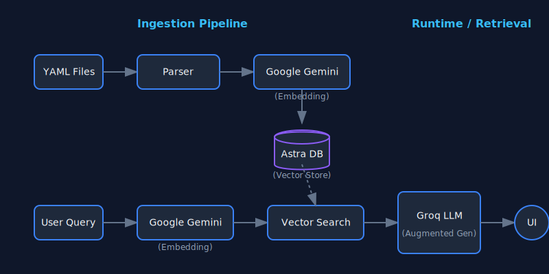

# Personal Intelligence App: RAG-based Chatbot

A personal intelligence engine that turns your portfolio and experience into an interactive, context-aware conversational agent. It uses first-person perspective to answer questions about your background, projects, and experience as if it were you.

## Tech Stack

- **Framework**: [Next.js 16](https://nextjs.org/) (App Router)
- **Language**: TypeScript
- **Styling**: [Tailwind CSS v4](https://tailwindcss.com/)
- **AI Models**:
  - **LLM**: [Groq](https://groq.com/) (Llama-3.3-70b-versatile)
  - **Embeddings**: [Google Generative AI](https://ai.google.dev/) (`gemini-embedding-001`)
- **Vector Database**: [DataStax Astra DB](https://astra.datastax.com/)
- **State Management**: [Vercel AI SDK](https://sdk.vercel.ai/)

## System Architecture

The application follows a RAG (Retrieval-Augmented Generation) pipeline:

## How It Works

1. **Ingestion** (`scripts/loadYaml.ts`):
   - Recursively walks `career_brain/` directory.
   - Parses YAML files (facts, projects, roles).
   - Generates embeddings using Google's `gemini-embedding-001`.
   - Stores text chunks + vectors in Astra DB.

2. **Retrieval** (`lib/astra.ts`):
   - On user query, generates a query embedding.
   - Performs a cosine similarity search in Astra DB.
   - Retrieves the top 5 most relevant context chunks.

3. **Generation** (`app/api/chat/route.ts`):
   - Constructs a strict system prompt defining the "Islam Hafez" persona.
   - Injects the retrieved context.
   - Streams the response from Groq's `llama-3.3-70b-versatile` model.