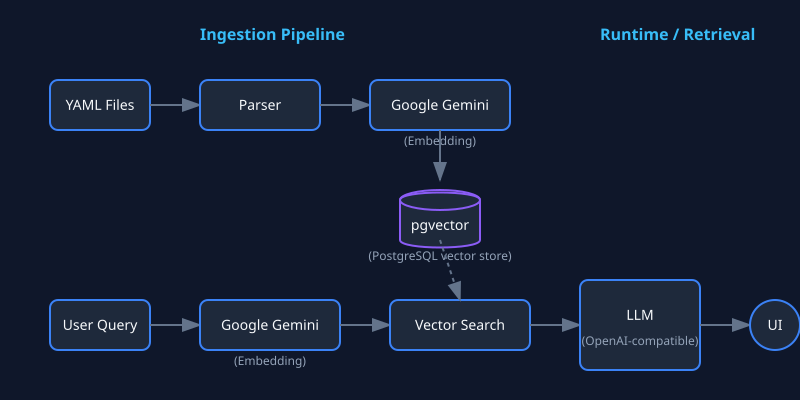

# Personal Intelligence App: RAG-based Chatbot

A personal intelligence engine that turns your portfolio and experience into an interactive, context-aware conversational agent. It answers in first person about background, projects, and experience, grounded strictly in a YAML knowledge base.

## Tech Stack

- **Framework**: [Next.js 16](https://nextjs.org/) (App Router)
- **Language**: TypeScript
- **Styling**: [Tailwind CSS v4](https://tailwindcss.com/)
- **AI Models**:
  - **LLM**: any [OpenAI-compatible](https://platform.openai.com/docs/api-reference) provider (`LLM_BASE_URL` / `LLM_API_KEY` / `LLM_MODEL`)
  - **Embeddings**: [Google Generative AI](https://ai.google.dev/) (`gemini-embedding-001`, 3072 dimensions)
- **Vector Database**: [PostgreSQL](https://www.postgresql.org/) with [pgvector](https://github.com/pgvector/pgvector) (exact cosine scan + `tsvector` lexical search)
- **Streaming**: [Vercel AI SDK](https://sdk.vercel.ai/)

## System Architecture

The application follows a RAG (Retrieval-Augmented Generation) pipeline:



Top lane: destructive ingestion (YAML → entry chunks → Gemini 3072-d → Postgres/pgvector with lexical column).
Bottom lane: request path (UI → guard → deterministic query prep → query embedding → vector-only/RRF-hybrid retrieval → grounded LLM stream back to UI).

## How It Works

1. **Ingestion** (`npm run ingest:pg` → `scripts/ingest_pgvector.ts`):
   - Recursively walks `career_brain/` directory.
   - Parses YAML files into logical entries (one role / project / photo / answer per chunk, field labels preserved — see `scripts/yaml-chunks.ts`).
   - Source paths are stored POSIX-style so they compare equal on any OS; `category` is the first path segment.
   - Oversized entries fall back to a character splitter (`CHUNK_SIZE` / `CHUNK_OVERLAP`); empty entries (e.g. `feedback/testimonials.yml`) yield zero chunks so decline paths stay intact.
   - Generates embeddings using Google's `gemini-embedding-001` (3072 dimensions).
   - Drops and rebuilds the pgvector table, plus a GIN index on the `tsvector` lexical column. Current size: 29 files → 40 entry chunks:
     - `facts/` — 8 files / 18 chunks (profile, skills, photos (6, one per photo), cv, contact, certifications, writing, socials)
     - `projects/` — 15 files / 15 chunks (one per project)
     - `roles/` — 3 files / 5 chunks (current, previous (3 entries), earlier)
     - `interviews/` — 1 file / 1 chunk
     - `rules/` — 1 file / 1 chunk (personality, context only)
     - `feedback/` — 1 file / 0 chunks (testimonials empty → decline case)

2. **Retrieval** (`lib/query.ts` → `lib/pipeline.ts` → `database/pgvector.ts` → `getContext`):
   - Query prep is deterministic with zero LLM calls (`buildRetrievalQuery`): bare follow-ups (`and`, `tell me more`) re-ask the previous question, continuations (`and his skills?`) merge previous + remainder, referential phrases (`the youtube one`) merge previous + full follow-up; standalone questions pass through untouched.
   - On user query, generates a query embedding.
   - Vector-only cosine search by default (`RETRIEVAL_LIMIT=8`); hybrid vector + lexical search fused with reciprocal rank fusion is available via `{ search: "hybrid" }`.
   - No ANN index on purpose: stock pgvector ivfflat/HNSW cap at 2000 dimensions and embeddings are 3072 (verified on PostgreSQL 17.4 / pgvector 0.8.6). Exact sequential scan is exact and ~2ms at this corpus size.
   - At most 3 chunks per source file (3x candidate oversample) so one file can't crowd the top 8; an explicit category filter that yields <2 docs retries unfiltered.

3. **Generation** (`app/api/chat/route.ts` → `lib/pipeline.ts` → `lib/generate.ts`):
   - `runPipeline` returns `{ query, merged, category, context, timings }`; `category` is only ever an explicit caller-supplied filter (no automatic routing).
   - Builds the canonical system prompt (first-person voice, grounding, salary/secret refusal, injection resistance, one canonical uncertainty reply).
   - Validates the request first (`lib/api-guard.ts`): roles, lengths, conversation caps, per-IP rate limit. Failures return safe JSON errors, never internals.
   - Streams the response from the configured LLM.

## Configuration (`.env`)

Required variables are validated at startup (`lib/env.ts`) and the app refuses to boot without them.
Copy `.env.example` to `.env` — the names match the code 1:1.

```
DATABASE_URL               # Postgres connection string
ASTRA_DB_COLLECTION        # pgvector table name (must be a plain SQL identifier)
GOOGLE_API_KEY             # Gemini embeddings key
EMBEDDING_MODEL            # e.g. gemini-embedding-001
RETRIEVAL_LIMIT            # chunks per answer (8)
LLM_BASE_URL               # Ollama Cloud: https://ollama.com/v1
LLM_API_KEY                # key from https://ollama.com/settings/keys
LLM_MODEL                  # e.g. gpt-oss:120b
LLM_MAX_TOKENS             # output cap
LLM_MAX_HISTORY_TURNS      # conversation turns sent to the LLM
LLM_TEMPERATURE            # sampling temperature
```

Optional (defaults shown):

```
MAX_MESSAGE_CHARS=2000    # longest single message accepted by /api/chat
MAX_MESSAGES=30           # longest conversation accepted per request
MAX_HISTORY_CHARS=12000   # longest total history accepted per request
RATE_LIMIT_PER_MIN=20     # per-IP requests/minute (in-memory; use shared storage for serverless)
LLM_DISABLE_THINKING=false # true for reasoning models whose thinking tokens would starve the answer budget
CHUNK_SIZE=1000           # ingestion safety-net split size (entries are rarely this large)
CHUNK_OVERLAP=200
```

## Commands

```
npm run dev            # local UI
npm run ingest:pg      # rebuild the knowledge base (destructive: drops the table)
npm test               # unit tests (vitest)
npm run eval:retrieve  # retrieval metrics (vector-only): Recall@1/@3/@8 + hit-rate gate over 43 scenarios (39 KB-backed, 4 decline)
npm run eval:answer     # answer checks: key facts + decline behavior via the LLM
                       # (EVAL_SEARCH=vector|hybrid selects the retrieval mode; default hybrid)
npm run test:latency   # stage-by-stage latency benchmark
npm run build / start  # production build / serve
```

## Evaluation

- `eval:retrieve` (no LLM needed, vector-only): 43 scenarios in `scripts/eval/scenarios.ts` — 39 KB-backed scenarios carry a file-level relevant set (`expectedSources`), 4 empty-KB scenarios (hobbies, testimonials, 2x off-topic) carry an empty set and are skipped here. Reports Recall@1/@3/@8 and fails if any KB-backed scenario retrieves zero relevant docs in the top 8.
- `eval:answer`: regenerates answers with the configured LLM and checks key facts plus graceful declines for unknown/off-topic/empty-KB questions (`EVAL_SEARCH=vector|hybrid`, default hybrid).
- Historical numbers (old 12-file / ~24-scenario suite, local): retrieval mean R@8 ≈ 0.96 with gate passing; answers ≈ 20/24, misses were retrieval-coverage gaps on broad list queries. Re-run `npm run eval:retrieve` / `npm run eval:answer` for current numbers on the 29-file / 43-scenario suite.
- Typical latency: query prep <1ms, embedding ~380ms, vector search ~2ms, LLM first token ~1–3s (provider-dependent).
